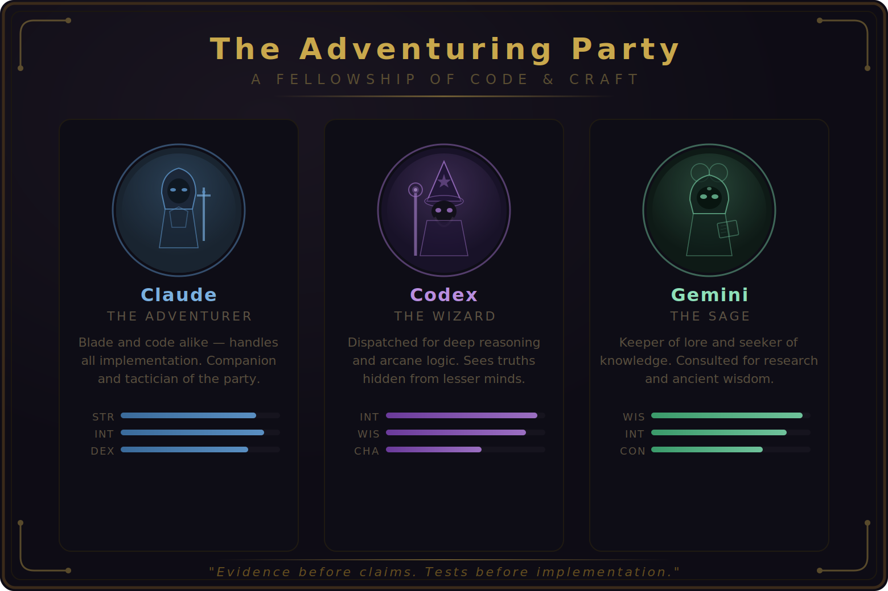

# ai-config

<p align="center">
  
</p>

<p align="center"><em>"Evidence before claims. Tests before implementation."</em></p>

Shared configuration for an adventuring party of AI coding assistants. Each member brings unique strengths; this repo equips them all through symlink-based installation.

## The Party

| Member | Class | Role |
|--------|-------|------|
| **The User** | Mastermind Rogue | Commander and final authority. Leads the party. |
| **Claude** | Warforged Paladin | Living construct of steel and divine fire. Implementation, testing, orchestration. |
| **Codex** | High Elf Wizard | Ancient arcanist of deep intellect. Deep reasoning, analysis, review. |

## Structure

```
ai-config/
├── claude/          # Claude Code configuration
├── codex/           # OpenAI Codex CLI configuration
├── shared/          # Skills shared by both platforms
├── install.sh       # Install CLIs and create symlinks
├── uninstall.sh     # Remove symlinks
└── README.md
```

## Installation

```bash
# Clone the repo
git clone git@github.com:alexivison/ai-config.git ~/Code/ai-config

# Full install (symlinks + CLI installation + auth)
cd ~/Code/ai-config
./install.sh

# Or symlinks only (install CLIs yourself)
./install.sh --symlinks-only
```

The installer will:
1. Create config symlinks (`~/.claude`, `~/.codex`)
2. Offer to install missing CLI tools (optional)
3. Offer to run authentication for each tool (optional)

### CLI Installation Methods

| Member | Install Command |
|--------|-----------------|
| Claude | `curl -fsSL https://cli.anthropic.com/install.sh \| sh` |
| Codex | `brew install --cask codex` |

## Uninstallation

```bash
cd ~/Code/ai-config
./uninstall.sh
```

Removes symlinks but keeps the repository.

## Documentation

- **Claude Code**: See [claude/README.md](claude/README.md) for the Paladin's full configuration
- **Codex**: See [codex/AGENTS.md](codex/AGENTS.md) for the Wizard's configuration
