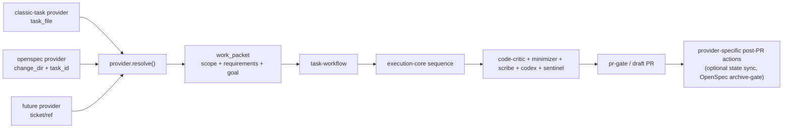
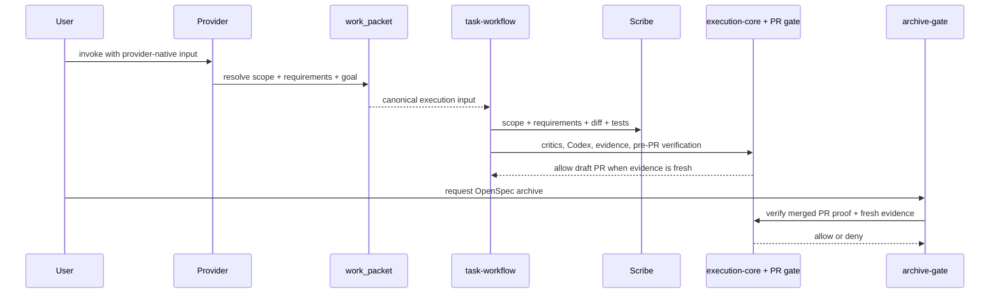

# Planning-Agnostic Harness Design

> **Specification:** [SPEC.md](./SPEC.md)

## Architecture Overview

The harness is strongest when it behaves like an execution governor, not a planning format parser. The new boundary is a provider-produced `work_packet`. Every planning source must resolve into the same minimal contract before `task-workflow` begins:

- `scope.in_scope`: what is explicitly in scope
- `scope.out_of_scope`: what is explicitly out of scope
- `requirements`: pre-extracted requirement strings
- `goal`: one-line summary for review and PR context

Classic TASK semantics become the baseline provider. OpenSpec becomes the first non-classic provider. Future providers may follow the same contract. The execution spine stays singular: `task-workflow -> execution-core -> critics/Codex/sentinel -> PR gate`. Providers may update their own human-readable state after PR creation if they wish, but that lives outside the engine and is not part of the work-packet contract.



## Existing Standards (REQUIRED)

| Pattern | Location | How It Applies |
|---------|----------|----------------|
| Task workflow hard-codes TASK/PLAN preflight, scope, scribe input, and checkbox updates | `claude/skills/task-workflow/SKILL.md:20-25`, `claude/skills/task-workflow/SKILL.md:39-46`, `claude/skills/task-workflow/SKILL.md:84-94` | These assumptions must be extracted into provider resolution; checkbox handling must leave the engine entirely |
| Scribe is a requirements auditor, not a style reviewer | `claude/agents/scribe.md:11-27`, `claude/agents/scribe.md:29-52` | The refactor should make `scribe` format-blind by supplying plain-text requirements and scope in the prompt |
| Execution-core owns order, scope enforcement, dispute resolution, and PR readiness semantics | `claude/rules/execution-core.md:9-13`, `claude/rules/execution-core.md:33-42`, `claude/rules/execution-core.md:97-98`, `claude/rules/execution-core.md:122`, `claude/rules/execution-core.md:178-180` | Replace TASK-native wording with provider/work-packet wording while keeping the sequence intact except for removing engine-owned checkbox handling |
| Plan workflow currently produces classic artifacts only | `claude/skills/plan-workflow/SKILL.md:59-74`, `claude/skills/plan-workflow/SKILL.md:196-208`, `claude/skills/plan-workflow/SKILL.md:229-233` | The engine must stop assuming its own planning output is the only valid source |
| Evidence hashing ignores Markdown and gates by diff hash, not planning format | `claude/hooks/lib/evidence.sh:99-123`, `claude/hooks/lib/evidence.sh:276-304` | Provider-owned planning-file policy should be decided explicitly, not accidentally |
| PR creation is gated by evidence, not by planning source | `claude/hooks/pr-gate.sh:30-89` | Provider refactors must not weaken PR enforcement |
| Hook interception surface is narrow | `claude/settings.json:84-164` | Provider-specific archive/apply behavior must rely on supported Bash/Skill entrypoints, not mythical universal slash-command interception |

**Why these standards:** The execution spine is already the valuable part of the harness. The least foolish refactor is to extract planning-format assumptions into providers, make `scribe` consume text instead of formats, and leave the governance machinery alone.

## File Structure

```text
claude/
├── agents/
│   └── scribe.md                               # Modify
├── hooks/
│   ├── archive-gate.sh                         # New
│   ├── lib/
│   │   └── evidence.sh                         # Modify later for provider-owned planning files
│   └── tests/
│       ├── test-archive-gate.sh                # New
│       ├── test-provider-routing.sh            # New
│       ├── test-pr-gate.sh                     # Modify later for provider cases
│       └── test-evidence.sh                    # Modify later for provider file policy
├── rules/
│   └── execution-core.md                       # Modify
├── skills/
│   ├── bugfix-workflow/
│   │   └── SKILL.md                            # Modify later for provider docs
│   ├── plan-workflow/
│   │   └── SKILL.md                            # Modify later for provider docs
│   ├── quick-fix-workflow/
│   │   └── SKILL.md                            # Modify later for provider docs
│   └── task-workflow/
│       ├── SKILL.md                            # Modify
│       ├── provider-interface.md               # New
│       └── providers/
│           ├── classic-task.md                 # New
│           └── openspec.md                     # New
└── settings.json                               # Modify
```

**Legend:** `New` = create, `Modify` = edit existing

## Naming Conventions

| Entity | Pattern | Example |
|--------|---------|---------|
| Provider id | kebab-case | `classic-task`, `openspec` |
| Core engine packet | stable struct name | `work_packet` |
| Scope fields | explicit names | `in_scope`, `out_of_scope` |
| Requirement item | plain text string | `"API returns 400 when token is missing"` |
| Goal summary | one-line text | `"Add OpenSpec provider support to the execution engine"` |
| Provider input examples | provider-specific refs | `task_file=...`, `change_dir=...`, `task_id=1.2` |

## Data Flow



Optional provider-side state sync may happen after PR creation, but it is outside engine semantics and is not represented in the `work_packet`.

## Data Transformation Points (REQUIRED)

| Layer Boundary | Code Path | Function | Input -> Output | Location |
|----------------|-----------|----------|-----------------|----------|
| Provider input -> work packet | Classic baseline | `resolve_provider(task_file)` | TASK file -> `{scope, requirements, goal}` | Extracts the native assumptions now embedded in `claude/skills/task-workflow/SKILL.md:20-25` and `claude/skills/task-workflow/SKILL.md:39-46` |
| Provider input -> work packet | OpenSpec | `resolve_provider(change_dir, task_id)` | `proposal.md + specs/ + design.md + tasks.md` -> `{scope, requirements, goal}` | Extends the baseline contract instead of changing engine behavior |
| Work packet -> review context | Shared | `build_review_context()` | `work_packet.scope + work_packet.goal` -> critic/Codex/sentinel prompt block | Replaces TASK-native prompt language in `claude/skills/task-workflow/SKILL.md:42-46` and `claude/rules/execution-core.md:122` |
| Work packet -> scribe prompt | Shared | `build_scribe_prompt()` | `work_packet.scope + work_packet.requirements + diff/tests` -> scribe prompt | Replaces `scribe` file-reading and requirement extraction in `claude/agents/scribe.md:21-44` |
| Branch diff -> evidence hash | Shared | `compute_diff_hash()` | merge-base diff -> `clean`, `unknown`, or SHA-256 | `claude/hooks/lib/evidence.sh:99-123` |
| Archive request -> allow/deny | OpenSpec only | `archive_gate()` | archive attempt + merged-PR lookup + evidence -> allow/deny | Mirrors `claude/hooks/pr-gate.sh:55-86` and uses `claude/settings.json:84-164` hook surfaces |

**Silent drop check:** Providers must fail closed if any of the required text fields are incomplete. No provider may guess `out_of_scope`, ask `scribe` to infer requirements from raw planning files, or rely on checkbox state as engine evidence.

## Integration Points (REQUIRED)

| Point | Existing Code | New Code Interaction |
|-------|---------------|----------------------|
| Engine preflight and review context | `claude/skills/task-workflow/SKILL.md:20-25`, `claude/skills/task-workflow/SKILL.md:39-46`, `claude/skills/task-workflow/SKILL.md:84-94` | Replace TASK-native reads/writes with `work_packet` consumption and remove engine-owned checkbox handling |
| Requirements audit | `claude/agents/scribe.md:11-27`, `claude/agents/scribe.md:29-52` | Replace `task_file`-only input with pre-extracted `requirements` text plus generic scope |
| Scope governance wording | `claude/rules/execution-core.md:9-10`, `claude/rules/execution-core.md:40`, `claude/rules/execution-core.md:122` | Replace TASK-native wording with provider/work-packet wording while keeping the same gates |
| Planning handoff docs | `claude/skills/plan-workflow/SKILL.md:59-74`, `claude/skills/plan-workflow/SKILL.md:196-208`, `claude/skills/plan-workflow/SKILL.md:229-233` | Document that plan-workflow produces classic provider inputs, not the engine's only valid planning format |
| Evidence and PR spine | `claude/hooks/lib/evidence.sh:99-123`, `claude/hooks/pr-gate.sh:30-89` | Remain unchanged in principle; only provider-owned planning-file policy is reconsidered later |
| Provider-specific post-PR behavior | `claude/settings.json:84-164` | Keep OpenSpec archive gating at the provider seam; any provider-side human-readable status sync remains optional and outside engine semantics |

## API Contracts

The harness changes internal workflow contracts rather than external HTTP APIs.

```text
planning provider contract:
  resolve(provider_input) -> work_packet

work_packet:
  scope:
    in_scope: [text, ...]
    out_of_scope: [text, ...]
  requirements: [text, ...]
  goal: text

task-workflow canonical input:
  work_packet: <resolved packet>

scribe canonical input:
  scope:
    in_scope: [text, ...]
    out_of_scope: [text, ...]
  requirements: [text, ...]
  diff_scope: <git diff ...>
  test_files: [...]
```

**Errors**

| Condition | Surface | Meaning |
|-----------|---------|---------|
| `PROVIDER_UNSUPPORTED` | provider entry | No registered provider can resolve the invocation |
| `PROVIDER_INPUT_INVALID` | provider entry | Provider-native input is malformed or incomplete |
| `WORK_PACKET_INCOMPLETE` | workflow error | One or more required concerns are missing from the resolved packet |
| `SCOPE_MISSING` | workflow error | `scope.in_scope` or `scope.out_of_scope` is absent |
| `REQUIREMENTS_MISSING` | scribe/workflow error | `requirements` is absent or empty |
| `GOAL_MISSING` | workflow error | `goal` is absent or empty |
| `OPENSPEC_ARCHIVE_BLOCKED` | archive gate | OpenSpec archive was attempted without merged-PR proof or fresh evidence |

## Design Decisions

| Decision | Rationale | Alternatives Considered |
|----------|-----------|-------------------------|
| Define a minimal `work_packet` with scope, requirements, and goal | The execution spine only needs scope, requirements, and a short review summary | Let each provider leak its own fields into `task-workflow` (rejected: conditional sprawl) |
| Keep completion tracking outside the engine | PR gating trusts evidence, not checkboxes. Human-readable task state is provider business, not engine contract | Make completion tracking a required engine field (rejected: not needed for governance) |
| Make `scribe` format-blind | The main agent/provider can extract the right requirements once; `scribe` should audit text, not parse planning systems | Keep `scribe` file-aware and provider-aware (rejected: duplicates format logic) |
| Treat classic TASK semantics as the baseline provider, not the engine's native format | This preserves current planning inputs while proving the engine no longer belongs to one planning system | Keep TASK files as special native input and bolt OpenSpec on beside them (rejected: not extensible) |
| Keep one execution spine for all providers | Critics, Codex, sentinel, evidence, and PR gating already work; planning format should not fork them | Separate OpenSpec/classic execution flows (rejected: drift and duplicate rules) |
| Make OpenSpec the first non-classic provider | It is the immediate user need and a real proof that the provider model works | Build a hypothetical provider API with no real non-classic provider (rejected: architecture without proof) |
| Keep archive behavior provider-specific | Not every planning system has archival semantics; OpenSpec does, so gate it at the provider seam | Force a generic archive model into every provider (rejected: fake generality) |
| Keep provider selection explicit, not repo-detected | Explicit entry preserves simplicity and avoids threaded provider conditionals | Detect provider type from directory structure (rejected: brittle and hidden) |

## External Dependencies

- **Classic baseline artifacts:** current TASK semantics in `task-workflow` and `scribe` remain the reference behavior to preserve through the baseline provider.
- **OpenSpec artifact contract:** `openspec/changes/<slug>/{proposal.md,design.md,tasks.md,specs/}` remains the upstream layout the provider reads.
- **Git + jq + shasum:** already required by `evidence.sh` and `pr-gate.sh`; provider work should reuse the same shell stack.
- **GitHub CLI auth:** OpenSpec archive gating needs merged-PR lookup, likely via `gh pr view --json state,mergedAt`.
- **Claude hook surfaces:** enforcement can route through Bash and Skill hooks only, per `claude/settings.json:84-164`.
