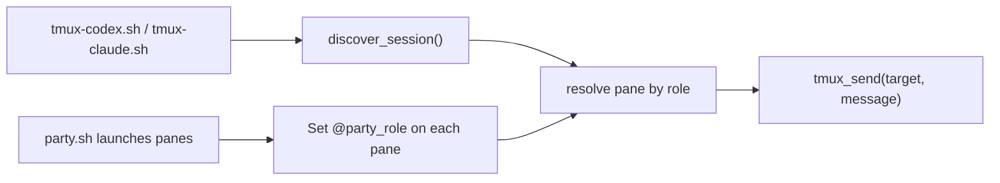
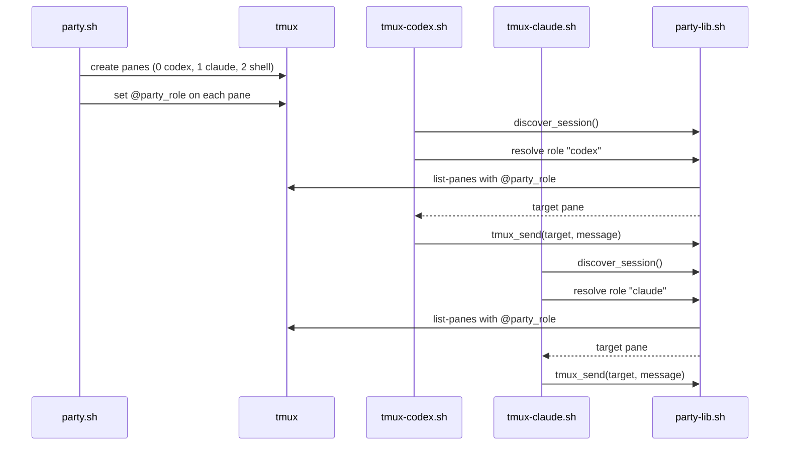

# Role-Based tmux Party Routing Design

> **Specification:** [SPEC.md](./SPEC.md)

## Architecture Overview

We will attach stable role metadata to tmux panes at launch time, then resolve routing targets by role in shared helpers. Transport scripts (`tmux-codex.sh`, `tmux-claude.sh`) will stop targeting hardcoded pane indices and instead request the pane for role `codex` or `claude`.

The launcher will also change default layout order to:
1. pane `0`: Codex
2. pane `1`: Claude
3. pane `2`: normal shell



## Existing Standards (REQUIRED)

| Pattern | Location | How It Applies |
|---------|----------|----------------|
| Session self-discovery for scripts | `session/party-lib.sh:170` | New routing helpers must use discovered session context, not global state |
| Shared message transport and backoff | `session/party-lib.sh:226` | Role routing must feed a resolved target into existing `tmux_send` behavior |
| Party launch orchestration in one function | `session/party.sh:88` | Pane creation, role tagging, pane titles, and initial selection stay centralized in `party_launch_agents` |
| Existing index-bound pane setup to replace | `session/party.sh:126`, `session/party.sh:129` | These become role-aware and 3-pane oriented |
| Existing hardcoded routing targets to replace | `codex/skills/claude-transport/scripts/tmux-claude.sh:19`, `claude/skills/codex-transport/scripts/tmux-codex.sh:15` | Replace with role lookup helper |
| Regression baseline for tests | `tests/run-tests.sh:28`, `tests/test-party-state.sh:38` | Extend suite with routing-focused coverage and include in main test runner |

**Why these standards:** They already define session scoping, message delivery semantics, and launch responsibilities. Reusing them avoids parallel routing logic and reduces drift between launcher and transports.

## File Structure

```
session/
├── party-lib.sh                                   # Modify (add role lookup helpers)
└── party.sh                                       # Modify (new pane order + role tags + role-aware theme)

codex/skills/claude-transport/scripts/
└── tmux-claude.sh                                 # Modify (resolve Claude pane by role)

claude/skills/codex-transport/scripts/
└── tmux-codex.sh                                  # Modify (resolve Codex pane by role)

tests/
├── run-tests.sh                                   # Modify (include routing tests)
└── test-party-routing.sh                          # New (unit-ish shell tests for role resolver/fallback)

README.md                                          # Modify (describe 3-pane default + role-based routing)
```

## Naming Conventions

| Entity | Pattern | Example |
|--------|---------|---------|
| Role key | lowercase token | `codex`, `claude`, `shell` |
| tmux user option | `@party_role` | `@party_role=codex` |
| Resolver function | `party_*_pane` style | `party_role_pane_target` |

## Data Flow



## Data Transformation Points (REQUIRED)

| Layer Boundary | Code Path | Function | Input → Output | Location |
|----------------|-----------|----------|----------------|----------|
| tmux pane introspection → role map | Shared | `party_role_pane_target` (new) | `list-panes` rows (`pane_id`, `pane_index`, `@party_role`) → target pane ID/string | `session/party-lib.sh` (new helper near discovery/send helpers) |
| Role request → concrete pane target | Claude → Codex | `_require_session`/resolver call (modified) | role literal `codex` → `CODEX_PANE=<resolved target>` | `claude/skills/codex-transport/scripts/tmux-codex.sh:13` |
| Role request → concrete pane target | Codex → Claude | resolver call (modified) | role literal `claude` → `CLAUDE_PANE=<resolved target>` | `codex/skills/claude-transport/scripts/tmux-claude.sh:19` |
| Pane metadata → border label | Shared | `configure_party_theme` (modified) | role metadata + env IDs → visible border format string | `session/party.sh:72` |
| Legacy fallback mapping | Shared fallback | resolver fallback logic (new) | missing `@party_role` + exactly 2 panes → legacy index (`claude`=>`0.0`, `codex`=>`0.1`) | `session/party-lib.sh` (new helper) |

**Silent drop check:** Role resolution must return a target or fail loudly before send. It must never silently choose an arbitrary pane. Duplicate roles (two panes with the same `@party_role`) must be treated as an error, not resolved nondeterministically.

**Fallback topology guard:** Legacy fallback must only activate when the session has exactly 2 panes and no role metadata — i.e., a proven pre-change layout. A 3-pane session missing metadata is not a legacy session; fallback must fail with `ROUTING_UNRESOLVED` to avoid cross-routing agents in the new layout.

## Integration Points (REQUIRED)

| Point | Existing Code | New Code Interaction |
|-------|---------------|----------------------|
| Session launch | `session/party.sh:88` | Add shell pane creation and role tagging for all panes |
| Theme rendering | `session/party.sh:72` | Replace index-driven label logic with role-driven logic |
| Claude transport entry | `claude/skills/codex-transport/scripts/tmux-codex.sh:13` | Route via role resolver before `tmux_send` |
| Codex transport entry | `codex/skills/claude-transport/scripts/tmux-claude.sh:19` | Route via role resolver before `tmux_send` |
| Shared transport function | `session/party-lib.sh:226` | Keep unchanged; only target resolution changes upstream |
| Test suite orchestration | `tests/run-tests.sh:28` | Add routing test suite to prevent index-coupling regressions |
| User-facing docs | `README.md:73` | Update default layout/routing explanation |

## API Contracts

Shell helper contracts (new):

```text
party_role_pane_target SESSION ROLE
  stdout: target pane (e.g. %12 or session:0.1)
  exit 0: resolved by role metadata
  exit 1: role not found

party_role_pane_target_with_fallback SESSION ROLE
  stdout: target pane (role-based first, legacy fallback second)
  exit 0: resolved
  exit 1: unresolved
```

**Errors:**

| Status | Code | Description |
|--------|------|-------------|
| 1 | `ROLE_NOT_FOUND` | Requested role has no pane in session |
| 1 | `ROLE_AMBIGUOUS` | Multiple panes carry the same `@party_role` value |
| 1 | `ROUTING_UNRESOLVED` | Neither role lookup nor fallback could resolve target |

## Design Decisions

| Decision | Rationale | Alternatives Considered |
|----------|-----------|-------------------------|
| Use tmux pane user option `@party_role` | Stable across pane reordering and splits; native tmux metadata | Parsing pane title text (rejected: cosmetic, mutable) |
| Keep legacy fallback during migration, guarded by topology check | Existing 2-pane sessions may lack role metadata; 3-pane sessions without metadata are not legacy and must fail explicitly | Hard-fail only (rejected: brittle upgrade path); unconditional fallback (rejected: misroutes in new layout) |
| Keep `tmux_send` unchanged | Current idle/backoff behavior is proven and already shared | Reimplement send logic per script (rejected: duplication risk) |
| Default to 3-pane layout | Matches requested operator workflow with local shell pane | Keep 2-pane default + optional shell command (rejected: misses stated target setup) |

## External Dependencies

- **tmux:** required for `list-panes`, pane user options, and send operations.
- **jq:** unchanged optional dependency for state manifest helpers.
